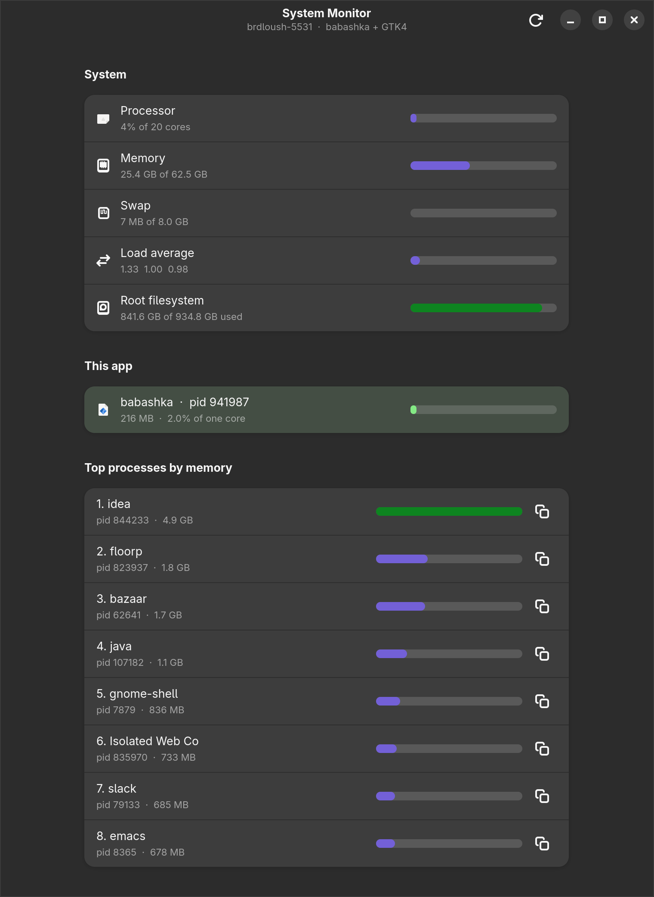
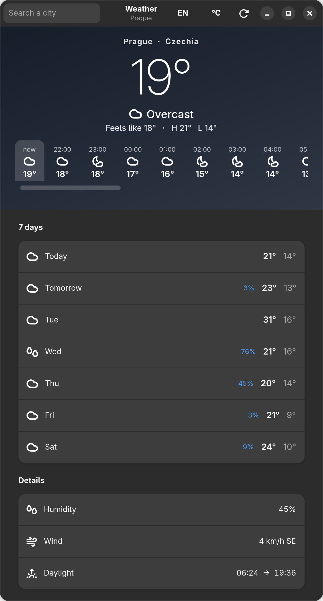

# gtkiccup

**Native GTK4 desktop apps from a [babashka](https://babashka.org) script.**
You write hiccup and keep your state in an atom. gtkiccup turns that into real
GTK widgets, and keeps them up to date as the state changes.

> [!WARNING]
> **This is very early work.** It started as an experiment and is closer to a
> proof of concept than to a library. The API will change, sometimes heavily,
> with no deprecation period. There is no release yet. Use it for fun and for
> experiments, not for anything you must maintain.

```clojure
(ns counter
  (:require [gtkiccup.core :as ui]
            [gtkiccup.ratom :as r]))

(defn counter []
  (let [n (r/atom 0)]
    (fn []
      [:vbox {:spacing 12 :margin 16}
       [:label "Count: " @n]
       [:hbox {:spacing 8}
        [:button {:label "- 1" :on-click #(swap! n dec)}]
        [:button {:label "+ 1" :on-click #(swap! n inc)}]
        [:button {:label "reset" :on-click #(reset! n 0)
                  :sensitive (not= 0 @n)}]]])))

(defn -main [& _]
  (ui/run (counter) :title "counter" :width 320 :height 160))
```

<p>
  
  
</p>

## Why you might care

- **Real native widgets.** Not a web view and not a canvas: GTK buttons,
  labels and lists, with GTK's look, keyboard handling and accessibility.
  Style them with CSS. libadwaita is optional, for a GNOME look.
- **No JVM, no build step, no generated bindings.** babashka calls the GTK C
  library directly through its FFI. A `.clj` file is the whole app.
- **Starts fast, idles at zero.** A window is up about 0.1 s after the process
  starts. An idle app uses 0.00% of a core: the main loop blocks until GTK or
  your state has something to do.
- **The REPL works on a live window.** Change state or redefine a view and the
  open window updates. Widgets are patched in place, so focus and half-typed
  text survive.
- **A proven diff.** The diffing is done by
  [Replicant](https://github.com/cjohansen/replicant), with keyed children,
  lifecycle hooks and handlers as data. gtkiccup is the GTK side of it.

## Background

Two posts made this possible, and are worth reading first:

- [babashka FFI](https://blog.michielborkent.nl/babashka-ffi.html), by
  Michiel Borkent (borkdude). babashka can call C libraries directly, which is
  what lets a script drive GTK at all.
- [glimmer-ui](https://yogthos.net/posts/2026-08-29-glimmer-ui.html), by
  Dmitri Sotnikov (yogthos). Declarative, Reagent-style GTK4 apps on
  [Jolt](https://github.com/jolt-lang/jolt). gtkiccup is the same idea on stock
  babashka. [glitter](https://github.com/jlt-commons/glitter) is its
  Replicant-style sibling, also on Jolt.

## Footprint

| | |
| --- | --- |
| library | about 2,000 lines of Clojure, libadwaita support and dev tools included |
| dependencies | one: Replicant, pure `.cljc` with no dependencies of its own |
| memory | about 220-230 MB resident for a small app. Most of it is the babashka binary and GTK itself. `bb -Xmx96m` saves about 20 MB |
| CPU when idle | 0.00% of a core |
| time to a window | about 0.1 s after the process starts |

Measured on Linux x86-64 with GTK 4.22 and babashka 1.13.222.

## Install

You need:

- **babashka 1.13.220 or later.** On Linux, the dynamically linked build: the
  static (musl) build cannot load system libraries, so FFI does not work with
  it.
- **GTK4** (`libgtk-4.so.1`). On Debian/Ubuntu: `apt install libgtk-4-1`. On
  macOS: `brew install borkdude/brew/babashka gtk4`.
- Optional: **libadwaita** (`libadwaita-1.so.0`), for `gtkiccup.adw`.
- `git`, to fetch the dependency. Java is not needed: babashka resolves
  dependencies without a JVM since 1.13.221.

It runs on Linux and macOS. The macOS part was first tried by
[@jirkapenzes](https://github.com/jirkapenzes), who ran
[Babatype](https://github.com/brdloush/babatype) on a Mac with Homebrew's
babashka and GTK4 — thank you! libadwaita on macOS is not tried yet.

There is no tagged release yet. Point your `bb.edn` at a checkout:

```clojure
{:deps {io.github.brdloush/gtkiccup {:local/root "../gtkiccup"}}}
```

When a release exists, this will become a git dependency:

```clojure
{:deps {io.github.brdloush/gtkiccup {:git/tag "v0.1.0" :git/sha "..."}}}
```

To try the examples, in a checkout of this repo:

```bash
bb counter    # the counter above
bb monitor    # a live system monitor
bb weather    # a weather app, no API key
bb deck examples/talk.md   # a markdown slide presenter
bb tasks      # everything else
```

## Documentation

| | |
| --- | --- |
| [Examples](docs/examples.md) | the example apps, what each one proves, and what they cost to run |
| [Widgets and props](docs/widgets.md) | every tag and prop, keyboard input, text children, keys, lifecycle hooks, data handlers, libadwaita |
| [REPL workflow and dev helpers](docs/repl.md) | reshaping a running window, threads, gotchas, auto-refresh and file watching |
| [Desktop integration](docs/desktop-integration.md) | app id, name and icon, so the window is not just "bb" |
| [How it works](docs/internals.md) | the namespaces, the renderer, the main loop, error recovery, extension points |
| [API](docs/api.md) | every public function |
| [Tests](docs/testing.md) | what each test file checks |
| [Limitations](docs/limitations.md) | what is missing and what is known to be rough |

## License

[MIT](LICENSE)
