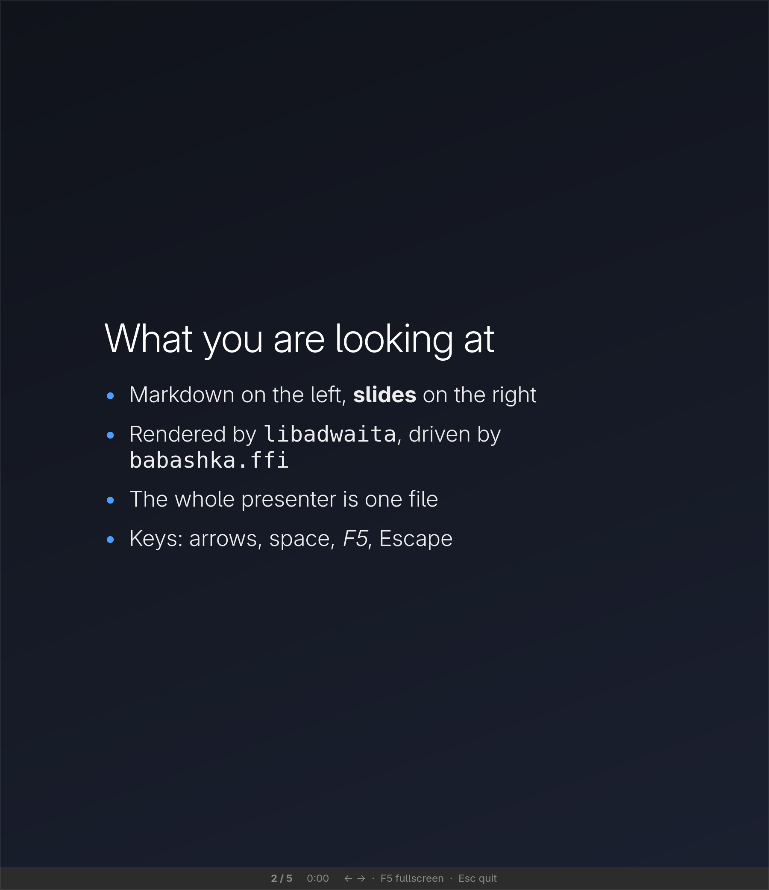

# Examples

Three examples do the arguing. Each renders its own screenshot, at the display's
full pixel density, via `bb shot` -- so on a 2x screen the PNG is twice the
window's size. That is why the images here have a fixed display width.

## Deck

`bb deck examples/talk.md` -- a markdown presenter, driven entirely by the
keyboard.



Slides animate between each other, and the animation is **declarative**: the
view sets `:page` on a `:carousel` and the spec turns that into
`adw_carousel_scroll_to`. So the app stays a pure function of state even though
it moves.

Edit the markdown while it is on screen and the slides reload, keeping your
place.

213 MB, 0.33% of a core, and a steady 62 fps while animating.

`examples/deckmd.clj` is the parser (pure, and the only place that knows about
Pango escaping), `examples/deck.clj` the app.

## Weather

`bb weather` -- Open-Meteo, so there is no API key and nothing to sign up for.


The colour is the point: weather code plus day/night picks one of 14 gradients,
and changing conditions only swaps a CSS class. Big light type, an hourly strip
that scrolls, a 7-day list, and a details group.

It **idles at 0.00% of a core**, 223 MB. It refreshes every 15 minutes, so the
blocking main loop genuinely does nothing in between. Works offline too: the
last response is cached, so the window opens with real content and an honest
banner saying how old it is.

**English and Czech.** The language starts from `LANG` and the header switches
it; the choice is saved next to the place and the units. Switching costs no
network call: `openmeteo` builds the view model in whatever language is in
force, so a switch is a rebuild from the response already cached. The
geocoding search sends the language too, so a Czech search for Prague answers
`Praha, Česko`.

`examples/weather.clj` is the UI, `examples/openmeteo.clj` the data,
`examples/weather_css.clj` the stylesheet and `examples/weather_i18n.clj` the
strings -- kept apart because a translator should not have to read the app,
and because the stylesheet is the whole reason it looks designed rather than
assembled.

## System monitor

`bb monitor` -- a libadwaita dashboard reading `/proc`, live:


Look at the row it highlights. An idle window built this way costs **0.00% of a
core**; the monitor measures under 1% over eight seconds, and all of that is its
own work -- it re-reads `/proc` and repaints fourteen rows every second. The figure
in the picture is a live one-second sample, so it jitters between 1 and 3%. Next
to it is a JetBrains IDE using 4.5 GB.

The UI is one pure function of one map. `examples/monitor.clj` is 155 lines,
`examples/sysinfo.clj` (all the `/proc` reading) is 215, and the libadwaita
bindings are 392. Core did not have to change much to allow it -- see
[Extension points](internals.md#extension-points).

## Keeping it small

`-Xmx96m` takes the monitor from 239 MB to 216. bb is a GraalVM native image and
**does** honour `-Xmx` -- proved by `-Xmx32m` dying and `-Xmx2000m` not. It has
to be on the command line, so the app tasks re-exec babashka with it via
`babashka.process/exec`, which keeps it to one process.

`-Xmx64m` saves another 10 MB and still runs; below about 48 MB the app dies on
startup. The remaining ~200 MB is mostly the babashka binary itself (63 MB
resident doing nothing) plus GTK, libadwaita and the theme.

### The renderer, and a mistake worth keeping

`GSK_RENDERER=cairo` saves about 50 MB by not mapping the GL/mesa stack, and for
a UI that never animates the output is pixel-identical. Two of these apps used
to force it.

They no longer do, and the reason is worth writing down. Counting real frames
with a GTK tick callback while a carousel animated:

| renderer | animating | monitor RSS | monitor CPU |
| --- | --- | --- | --- |
| `cairo` | **36 fps** | 165 MB | 1.00% |
| default | 62 fps | 213 MB | **0.83%** |
| `vulkan` | 65 fps | 211 MB | 1.33% |

Software rendering cannot repaint a full-screen window at 60 Hz, so the deck was
visibly choppy. But look at the CPU column: cairo does not even win there --
the default is *cheaper*. So cairo buys 50 MB and nothing else, at the cost of a
per-app trap that has to be remembered.

All three now use whatever GTK picks, which is what every other GTK app on the
machine does. `vulkan` is no better on memory, mixed on CPU, and depends on
drivers that may not be present, so it is not worth forcing either.

If you want the 50 MB on a static UI of your own, set `GSK_RENDERER=cairo` in
the environment and measure your own animation cost first.

## Run it

```bash
bb deck examples/talk.md   # the markdown presenter
bb weather    # the Open-Meteo weather app
bb monitor    # the libadwaita system monitor
bb counter    # the glimmer counter
bb todo       # dynamic list, entry, check buttons

bb shot weather   # regenerate a screenshot (the app shoots itself)
LANG=cs_CZ.UTF-8 bb shot weather docs/images/weather-cs.png   # the same, in Czech
bb shot monitor
bb shot deck
bb test       # all nineteen test files (see Tests below)
bb dev        # nREPL server on 1667, for editor-driven work

bb install-desktop     # Linux: make the apps look native in the switcher and app grid
bb uninstall-desktop   # and undo it

bb tasks      # list them
```

Needs babashka >= 1.13.220 and GTK4 (`libgtk-4.so.1`). `bb weather` and
`bb monitor` also need libadwaita (`libadwaita-1.so.0`, 1.9 here) and reads `/proc`, so it is
Linux-only. `bb weather` needs the network on first run only. Both re-exec
babashka with `-Xmx96m`, for the reason in [Keeping it small](#keeping-it-small).
